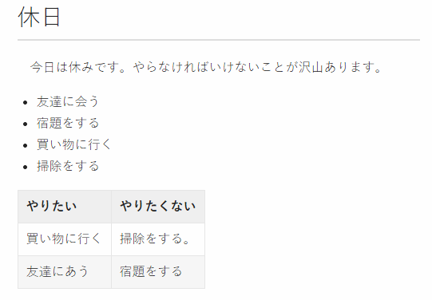

# プログラミング初心者から見たMarkdown

## はじめに

お疲れ様です。
入社5カ月目のワードです。５カ月目の身では、なかなか他人から見て有用な情報というものがないのですが、ない経験をふり絞って、今回は最近触れたMarkdownのことを記事にしようかとおもいます。

## Markdownとは

みなさんはMarkdownというものをご存知でしょうか。私はこの業界に入ってつい最近その存在を知ったのですが、ブログ作成したり、ＩＴ系の業種の人たちの中ではわりと一般的なものなようです。

というのもこのMarkdownという言語、エディタ上でメモとして活用するひともいますが、結局のところWeb上で使用しようとするとHTMLに変換されます。
このようなものを軽量マークアップ言語というのですが、有名なとこでは皆さんもご存じウィキのウィキテキスト。他にはブログサービスで有名なはてなダイアリーのはてな記法などがあります。

では、Markdownの強みは何でしょう？
 せっかくなので思いつくことを以下に挙げてみましょう。

- 素早く書け、また簡単でる。
- HTMLに変換できる。
- エディタが豊富である。

正直なところ、Markdownで複雑なテーブルやプルダウン、ボタンなどのあるページを作成するのはむいてません。(というかできません！)
上にもある通り、Markdownの強みは特定の形式に限られるかわりに、とても効率的にページの作成ができることと、そのとっつきやすさにあるのではないでしょうか。

## Markdown記法

では、Markdown記法というのがどういうものか見ていきましょう。

まずはサンプルとしてこのようなページを作ってみました。



このページをHTMLで表示しようとするとこうなります。

```html
<h1>休日</h1>
<hr>

<br/> 今日は休みです。やらなければならないことが沢山あります。
<br/>

<ul>
    <li>友達に会う</li>
    <li>宿題をする</li>
    <li>買い物に行</li>
    <li>掃除をする</li>
</ul>

<table>
    <tr>
        <td>やりたい</td>
        <td>やりたくない</td>
    </tr>
    <tr>
        <td>買い物に行く</td>
        <td>掃除をする。</td>
    </tr>
    <tr>
        <td>友達にあう</td>
        <td>宿題をする</td>
    </tr>
</table>
```

ではこれをMarkdownを使って記述するとどうなるでしょう。

```
# 休日

　今日は休みです。やらなければいけないことが沢山あります。
 
 - 友達に会う
 - 宿題をする
 - 買い物に行く
 - 掃除をする

|やりたい|やりたくない|
|:-|:-|
|買い物に行く|掃除をする|
|友達にあう|宿題をする|
```

短いですね。
もちろん複雑なページをMarkdown単体で作ることは厳しいです。しかし、Markdownエディタは大抵HTMLにも対応しています。つまり、簡単なテーブルやリスト、地の文などの部分はMarkdown記法で記述し、凝りたい部分はCSSやHTMLタグを用いれば全然問題がなさそうですね。

## エディタ

以下ではMarkdownに対応したソフトを紹介します。といっても、僕はBracketsとKobitoしか使用したことがないので、それぞれの詳細は分かりません。
いつか気が向いたときにそれぞれのエディタを確かめてみようかと思います。

- [Kobito](http://kobito.qiita.com/win)
- [Brackets](http://brackets.io/)
- [MarsEdit](https://red-sweater.com/marsedit/)
- [Mou](http://25.io/mou/)
- [MarkdownPad](http://markdownpad.com/)

## おわりに

普段あまり文章をかかない身としては、何かを調べて人に伝えるという機会を与えてもらえて、とてもよかったと思います。
まだこの業界に入って間もないですが、今後も勉強を続けていけたらと思います。
そして、このページは自身の勉強の一環として、なるべくMarkdownで記述しています。実のところ、初めのうちはMarkdownに対応していないブログかなにかに、MarkdownをHTMLに変換したものを投稿しようかとも思いましたが、いまいち思い通りの結果にならす断念してしいました。
自分の情報収集能力の低さを実感したのと、次の機会には自分の満足いく結果を出せたらなと思います。

#### おまけ

[このページのmdファイル](./lib/BeginnerMD.zip)
